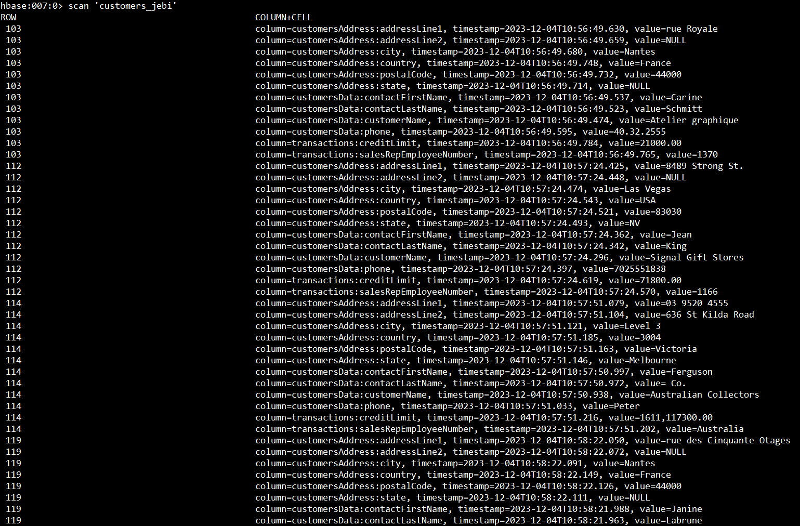
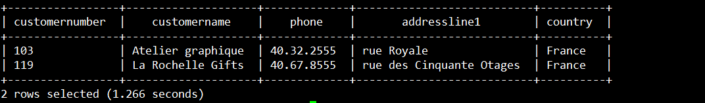

# Hive and Hbase Integrations
Hive berfungsi sebagai sistem data warehousing dan query language di atas Hadoop, sedangkan HBase adalah database NoSQL terdistribusi yang dirancang untuk menyimpan data yang bersifat sparse. 

Dengan menggunakan ```HBaseStorageHandler```, Hive dapat berinteraksi dengan tabel HBase seolah-olah itu adalah tabel Hive, hal ini memungkinkan user HiveQL untuk query data yang disimpan di HBase.

### Siapkan Data
customers.csv
```
103,Atelier graphique,Schmitt,Carine ,40.32.2555,54 rue Royale,NULL,Nantes,NULL,44000,France,1370,21000.00
112,Signal Gift Stores,King,Jean,7025551838,8489 Strong St.,NULL,Las Vegas,NV,83030,USA,1166,71800.00
114,Australian Collectors, Co.,Ferguson,Peter,03 9520 4555,636 St Kilda Road,Level 3,Melbourne,Victoria,3004,Australia,1611,117300.00
119,La Rochelle Gifts,Labrune,Janine ,40.67.8555,67 rue des Cinquante Otages,NULL,Nantes,NULL,44000,France,1370,118200.00
121,Baane Mini Imports,Bergulfsen,Jonas ,07-98 9555,Erling Skakkes gate 78,NULL,Stavern,NULL,4110,Norway,1504,81700.00
124,Mini Gifts Distributors Ltd.,Nelson,Susan,4155551450,5677 Strong St.,NULL,San Rafael,CA,97562,USA,1165,210500.00
125,Havel & Zbyszek Co,Piestrzeniewicz,Zbyszek ,(26) 642-7555,ul. Filtrowa 68,NULL,Warszawa,NULL,01-012,Poland,NULL,0.00
128,Blauer See Auto, Co.,Keitel,Roland,+49 69 66 90 2555,Lyonerstr. 34,NULL,Frankfurt,NULL,60528,Germany,1504,59700.00
129,Mini Wheels Co.,Murphy,Julie,6505555787,5557 North Pendale Street,NULL,San Francisco,CA,94217,USA,1165,64600.00
131,Land of Toys Inc.,Lee,Kwai,2125557818,897 Long Airport Avenue,NULL,NYC,NY,10022,USA,1323,114900.00
```

#
### Buat tabel dan family column hbase
```
create 'customers_jebi', 'customersData', 'customersAddress', 'transactions'
```


List Family Column data table
```
- RowKey:customerNumber
- customersData:customerName
- customersData:contactLastName
- customersData:contactFirstName
- customersData:phone
- customersAddress:addressLine1
- customersAddress:addressLine2
- customersAddress:city
- customersAddress:state
- customersAddress:postalCode
- customersAddress:country
- transactions:salesRepEmployeeNumber
```
#
### sh script untuk input data ke tabel hbase
```
HBASE_SHELL="hbase shell"
TABLE_NAME="customers_jebi"

CSV="/home/hbase/customers.csv"

cat "$CSV" | while IFS=, read -r customerNumber customerName contactLastName contactFirstName phone addressLine1 addressLine2 city state postalCode country salesRepEmployeeNumber creditLimit; do
  $HBASE_SHELL <<EOF
put '$TABLE_NAME', '$customerNumber', 'customersData:customerName', '$customerName'
put '$TABLE_NAME', '$customerNumber', 'customersData:contactLastName', '$contactLastName'
put '$TABLE_NAME', '$customerNumber', 'customersData:contactFirstName', '$contactFirstName'
put '$TABLE_NAME', '$customerNumber', 'customersData:phone', '$phone'
put '$TABLE_NAME', '$customerNumber', 'customersAddress:addressLine1', '$addressLine1'
put '$TABLE_NAME', '$customerNumber', 'customersAddress:addressLine2', '$addressLine2'
put '$TABLE_NAME', '$customerNumber', 'customersAddress:city', '$city'
put '$TABLE_NAME', '$customerNumber', 'customersAddress:state', '$state'
put '$TABLE_NAME', '$customerNumber', 'customersAddress:postalCode', '$postalCode'
put '$TABLE_NAME', '$customerNumber', 'customersAddress:country', '$country'
put '$TABLE_NAME', '$customerNumber', 'transactions:salesRepEmployeeNumber', '$salesRepEmployeeNumber'
put '$TABLE_NAME', '$customerNumber', 'transactions:creditLimit', '$creditLimit'
EOF
done
```


Kemudian jalankan script nya.
```
chmod +x puthbase.sh
./puthbase.sh
```
#
### Cek data yang telah diinput di tabel hbase
scan 'customer_jebi'


#

### Buka hive shell dan buat tabel yang akan diintergrasi dengan table hbase

```
su - hive
beeline -n hive -p hive
```

*Syntax command create table :*
```
CREATE EXTERNAL TABLE IF not exists <nama tabel> (kolom1 tipedata1, kolom2 tipedata2, ...)
ROW FORMAT DELIMITED
FIELDS TERMINATED BY ','
STORED BY 'org.apache.hadoop.hive.hbase.HBaseStorageHandler'
WITH SERDEPROPERTIES ("hbase.columns.mapping"=":key,<family column.column>,<family column.column>,...")
TBLPROPERTIES("hbase.table.name"="namaTabelHbase")
;
```

Sesuaikan `serdeproperties` degan family column tabel hbase dan data yang diinput didalam tabel
```
CREATE EXTERNAL TABLE IF NOT EXISTS hive_customers_jebi (
  customerNumber STRING,
  customerName STRING,
  contactLastName STRING,
  contactFirstName STRING,
  phone STRING,
  addressLine1 STRING,
  addressLine2 STRING,
  city STRING,
  state STRING,
  postalCode STRING,
  country STRING,
  salesRepEmployeeNumber STRING,
  creditLimit STRING
)
STORED BY 'org.apache.hadoop.hive.hbase.HBaseStorageHandler'
WITH SERDEPROPERTIES ("hbase.columns.mapping"=":key,customersData:customerName,customersData:contactLastName,customersData:contactFirstName,customersData:phone,customersAddress:addressLine1,customersAddress:addressLine2,customersAddress:city,customersAddress:state,customersAddress:postalCode,customersAddress:country,transactions:salesRepEmployeeNumber,transactions:creditLimit")
TBLPROPERTIES("hbase.table.name"="customers_jebi");
```


#

#
### Cek data dari tabel `hive_customers_jebi`
Sekarang tabel ini sudah terintegrasi dengan tabel hbase `customers_jebi`. Tabel ini menggunakan ```HBaseStorageHandler``` untuk menginterpretasi struktur tabel dari HBase. 
```
select * from hive_customers_jebi;
```

    
#
### Tes Query untuk mengakses data

Menampilkan data nama, phone dan kota

```
SELECT customername, phone, city FROM hive_customers_jebi;
```

#

Menampilkan data customer dari france

```
SELECT customerNumber, customername, phone, addressline1, country FROM hive_customers_jebi WHERE country = 'France';
```
