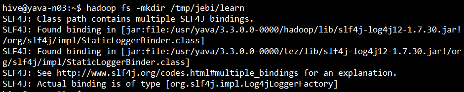
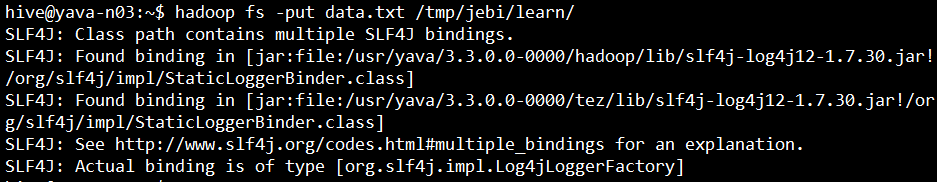
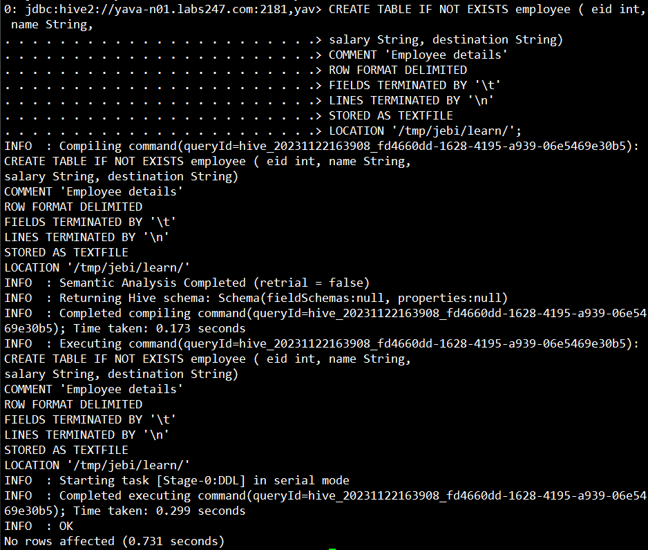
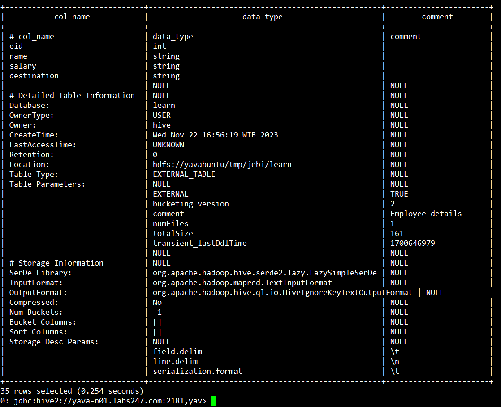
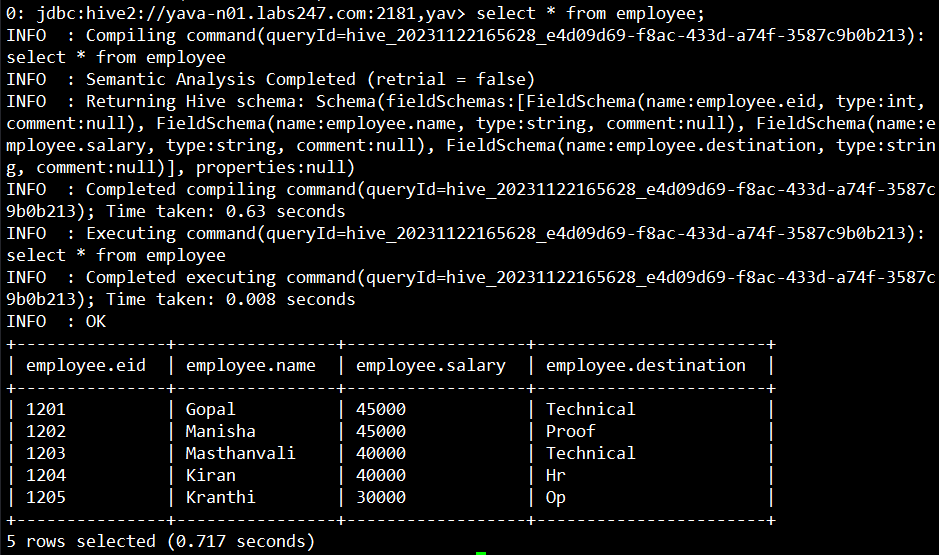

## Hive Tutorial

1. Switch user ke hive
   
    ```sh
    su - hive
    ```
    #
2. Buat sebuah data dengan format text file, pisahkan antar kolom dengan `tab` :
    ```sh
    1201  Gopal       45000    Technical manager
    1202  Manisha     45000    Proof reader
    1203  Masthanvali 40000    Technical writer
    1204  Kiran       40000    Hr Admin
    1205  Kranthi     30000    Op Admin
    ```
    #
   
3. Create direktori di hdfs yang akan digunakan untuk menyimpan file
   ```sh
   hadoop fs -mkdir /tmp/jebi/learn
   ```
   
   #
4. Pindahkan file kedalam hdfs
   ```sh
   hadoop fs -put data.txt /tmp/jebi/learn/
   ```
   
   #
5. Akses Hive menggunakan Beeline dengan command berikut
   ```sh
   beeline -n hive -p hive
   ```
   Perintah ini menggunakan opsi -n untuk menentukan `username` dan opsi -p untuk menentukan `password`.

   
   #
6. Create database baru lalu masuk ke database
   ```sh
   CREATE DATABASE learn;
   USE learn;
   ```
   #
7. Create table dan load file data dari hdfs
    ```sh
    CREATE TABLE IF NOT EXISTS employee ( eid int, name String,
    salary String, destination String)
    COMMENT 'Employee details'
    ROW FORMAT DELIMITED
    FIELDS TERMINATED BY '\t'
    LINES TERMINATED BY '\n'
    STORED AS TEXTFILE
    LOCATION '/tmp/jebi/learn/';
    ```
   
   
   #
8. Gunakan command berikut untuk mendapatkan informasi terperinci tentang struktur dan konfigurasi dari tabel "employee".
   ```sh
   DESC FORMATTED employee
   ```
   
   #
9.  Tampilkan data dalam table
    ```sh
    SELECT * FROM employee
    ```
    
    #


