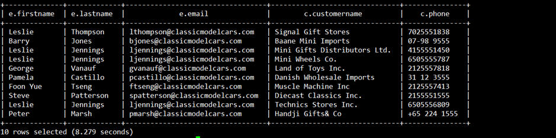
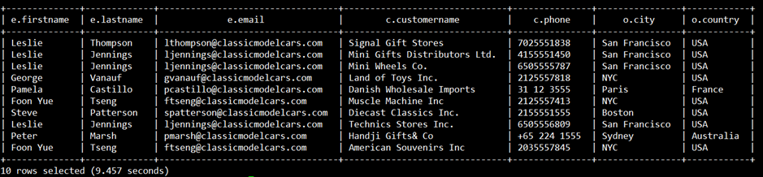
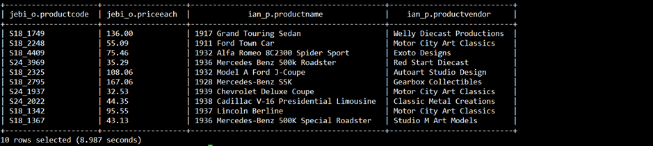

## Join Antar Table

### Create Table Customers

```sh
CREATE EXTERNAL TABLE IF NOT EXISTS customers (
  customerNumber INT,
  customerName STRING,
  contactLastName STRING,
  contactFirstName STRING,
  phone STRING,
  addressLine1 STRING,
  addressLine2 STRING,
  city STRING,
  state STRING,
  postalCode STRING,
  country STRING,
  salesRepEmployeeNumber INT,
  creditLimit DECIMAL(10,2)
)
COMMENT 'Customer details'
ROW FORMAT DELIMITED
FIELDS TERMINATED BY ','
LINES TERMINATED BY '\n'
STORED AS TEXTFILE
LOCATION '/tmp/jebi/customers/'
TBLPROPERTIES ("skip.header.line.count"="1", "skip.footer.line.count"="1");
```

#
### Create table employees
```sh
CREATE EXTERNAL TABLE IF NOT EXISTS employees (
  employeeNumber INT,
  lastName STRING,
  firstName STRING,
  extension STRING,
  email STRING,
  officeCode STRING,
  reportsTo INT,
  jobTitle STRING
)
COMMENT 'Employee details'
ROW FORMAT DELIMITED
FIELDS TERMINATED BY ','
LINES TERMINATED BY '\n'
STORED AS TEXTFILE
LOCATION '/tmp/jebi/employees/'
TBLPROPERTIES ("skip.header.line.count"="1", "skip.footer.line.count"="1");
```
#
### Create table offices
```sh
CREATE EXTERNAL TABLE IF NOT EXISTS offices (
  officeCode STRING,
  city STRING,
  phone STRING,
  addressLine1 STRING,
  addressLine2 STRING,
  state STRING,
  country STRING,
  postalCode STRING,
  territory STRING
)
COMMENT 'Office details'
ROW FORMAT DELIMITED
FIELDS TERMINATED BY ','
LINES TERMINATED BY '\n'
STORED AS TEXTFILE
LOCATION '/tmp/jebi/offices/'
TBLPROPERTIES ("skip.header.line.count"="1", "skip.footer.line.count"="1");
```

#
### Create table orderdetails
```sh
CREATE EXTERNAL TABLE IF NOT EXISTS orderdetails (
  orderNumber INT,
  productCode STRING,
  quantityOrdered INT,
  priceEach DECIMAL(10,2),
  orderLineNumber SMALLINT
)
COMMENT 'Order details'
ROW FORMAT DELIMITED
FIELDS TERMINATED BY ','
LINES TERMINATED BY '\n'
STORED AS TEXTFILE
LOCATION '/tmp/jebi/orderdetails/'
TBLPROPERTIES ("skip.header.line.count"="1", "skip.footer.line.count"="1");
```

# 
# Join table dalam 1 database
### Join 2 tabel
Join tabel empolyees dan customers
```sh
SELECT  
  e.firstName,
  e.lastName,
  e.email,
  c.customerName,
  c.phone
FROM customers c
JOIN employees e ON c.salesRepEmployeeNumber = e.employeeNumber
LIMIT 10;
```

 #
### Join 3 tabel
Join tabel empolyees, customers dan offices

```sh
SELECT
  e.firstName,
  e.lastName,
  e.email,
  c.customerName,
  c.phone,
  o.city,
  o.country
FROM customers c
JOIN employees e ON c.salesRepEmployeeNumber = e.employeeNumber
JOIN offices o ON e.officeCode = o.officeCode
LIMIT 10;
```


#
.
# Join table Antar Database
### Join 2 table
Join tabel orderdetails di database jebi dan tabel products di database ian
```sh
SELECT
  jebi_orderdetails.productCode,
  jebi_orderdetails.priceEach,
  ian_products.productName,
  ian_products.productVendor
FROM jebi.orderdetails AS jebi_orderdetails 
JOIN ian.products AS ian_products 
ON jebi_orderdetails.productCode = ian_products.productCode
LIMIT 10;
```


#
### Join 3 table
Join tabel customers di database jebi, tabel payment dan orders dari database ian
```sh
SELECT 
 jebi_c.customerName,
 jebi_c.phone,
 ian_o.orderDate,
 ian_p.amount,
 ian_p.paymentDate
FROM ian.orders AS ian_o 
JOIN jebi.customers AS jebi_c ON ian_o.customerNumber = jebi_c.customerNumber
JOIN ian.payments AS ian_p ON jebi_c.customerNumber = ian_p.customerNumber
LIMIT 10;
```
