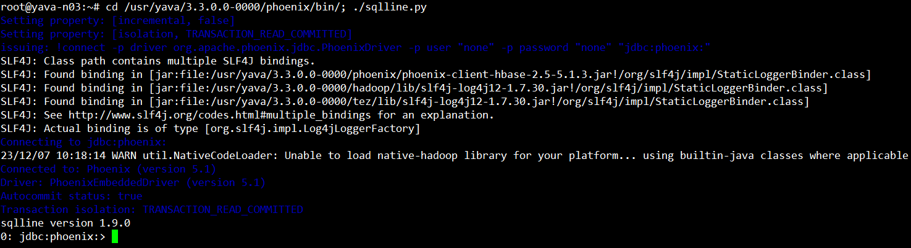
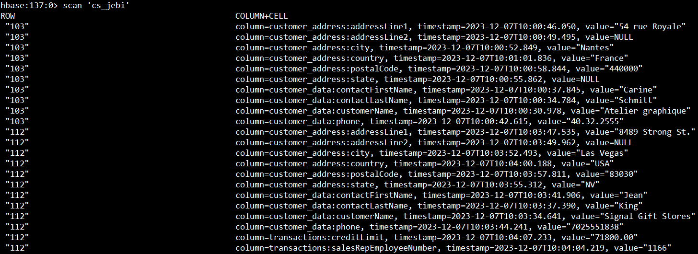
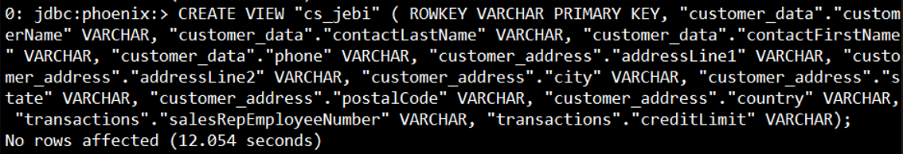
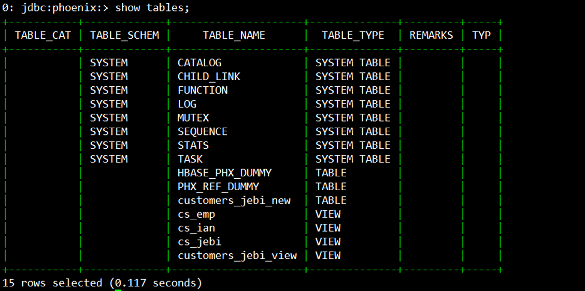
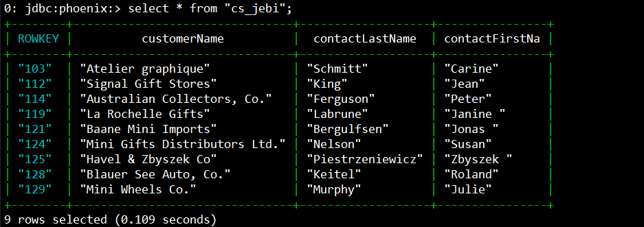

# Access Hbase data from Phoenix

### Jalankan sqqline.py
```
cd /usr/yava/3.3.0.0-0000/phoenix/bin/; ./sqlline.py
```

#
### Tentukan tabel yang akan di akses dari phoenix
Contoh tabel yang akan diakses adalah table 'cs_jebi'



#
### Create view untuk tabel dari hbase

```
CREATE VIEW "cs_jebi" (ROWKEY VARCHAR PRIMARY KEY, "customer_data"."customerName" VARCHAR, "customer_data"."contactLastName" VARCHAR, "customer_data"."contactFirstName" VARCHAR, "customer_data"."phone" VARCHAR, "customer_address"."addressLine1" VARCHAR, "customer_address"."addressLine2" VARCHAR, "customer_address"."city" VARCHAR, "customer_address"."state" VARCHAR, "customer_address"."postalCode" VARCHAR, "customer_address"."country" VARCHAR, "transactions"."salesRepEmployeeNumber" VARCHAR, "transactions"."creditLimit" VARCHAR);
```
Perintah CREATE VIEW di atas digunakan untuk membuat view dengan nama "cs_jebi" dalam Apache Phoenix, yang beroperasi di atas Apache HBase. View ini dirancang untuk menciptakan tampilan yang terstruktur dari data yang ada di dalam tabel hbase.



#
### Cek view yang telah dibuat
```
show tables;
```

#
### Mengakses data didalam tabel
```
select * from "cs_jebi";
```
