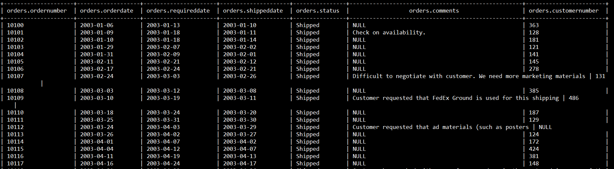
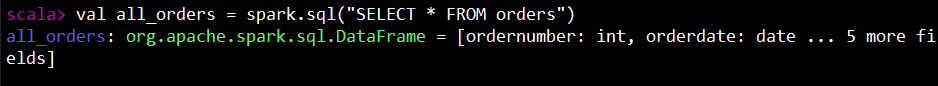

# Spark SQL Access to hive

### Jalankan spark shell
```
su - spark
spark-shell
```


#
### Deklarasi Variabel 
Deklarasikan nama variabel untuk menyimpan hasil eksekusi perintah SQL pada tabel yang dipilih dalam spark.
```
val <nama_variabel> = spark.sql("SELECT * FROM <nama_tabel>")
```



Contoh : menggunakan table "orders" dari hive
```
val all_orders = spark.sql("SELECT * FROM orders")
```




#
### Menampilkan DataFrame
```
<nama variable>.show()
```
```
all_orders.show()
```


#
### Menampilkan Jumlah Baris Tertentu 
Menampilkan 10 baris dari DataFrame all_orders
```
all_orders.show(10)
```
