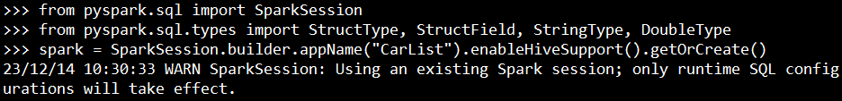
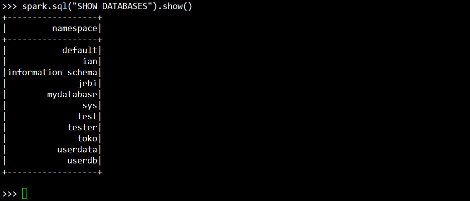
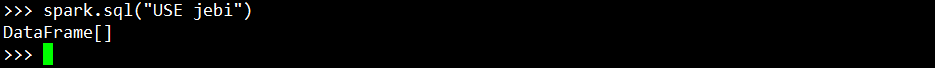
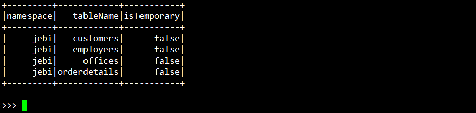
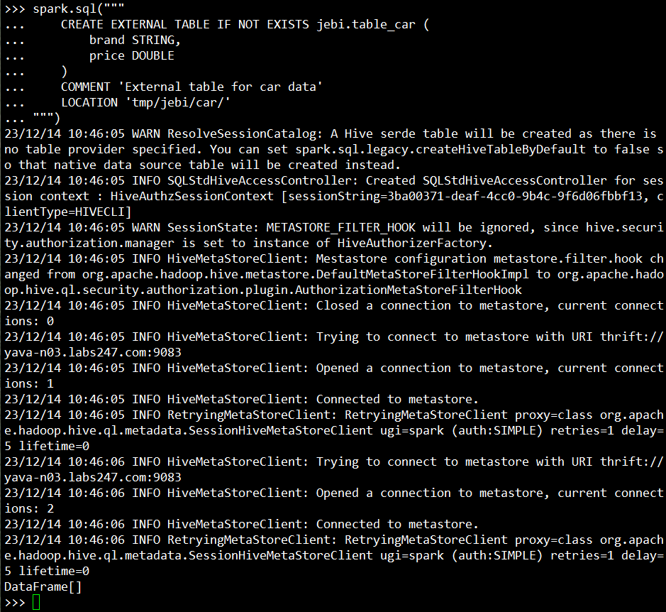
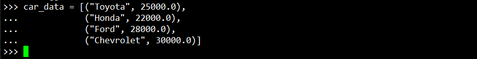
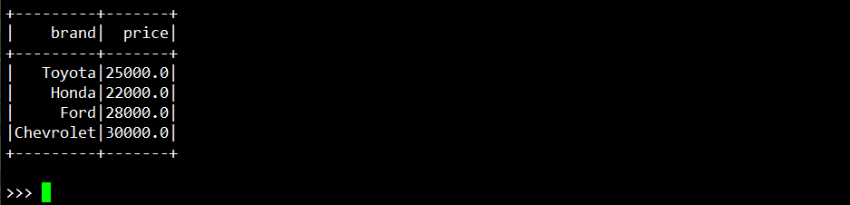
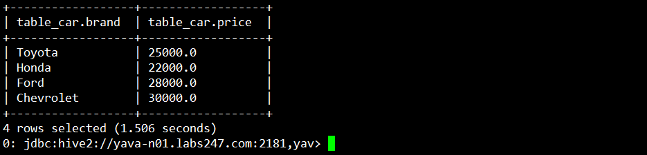

## Create session
```
from pyspark.sql import SparkSession
from pyspark.sql.types import StructType, StructField, StringType, DoubleType
spark = SparkSession.builder.appName("CarList").enableHiveSupport().getOrCreate()
```


#
## Konfirmasi database dan table Hive
```
spark.sql("SHOW DATABASES").show()
```


```
spark.sql("USE jebi") 
```


```
spark.sql("SHOW TABLES").show()
```



#
## Create external table Hive
```
spark.sql("""
    CREATE EXTERNAL TABLE IF NOT EXISTS jebi.table_car (
        brand STRING,
        price DOUBLE
    )
    COMMENT 'External table for car data'
    LOCATION 'tmp/jebi/car/'
""")
``` 

#
## Create data
```
car_data = [("Toyota", 25000.0),
            ("Honda", 22000.0),
            ("Ford", 28000.0),
            ("Chevrolet", 30000.0)]
```


#
## Define the schema for the DataFrame
```
schema = StructType([
    StructField("brand", StringType(), True),
    StructField("price", DoubleType(), True)
])
```

#
## Create the DataFrame
```
myCarList = spark.createDataFrame(car_data, schema=schema)
```


#
## Show the DataFrame
```
myCarList.show()
```

#
## Insert data ke tabel hive
```
myCarList.write.insertInto("jebi.table_car") 
```
#
## Read data yang telah diinput dari tabel hive
```
hive > select * from table_car
```
