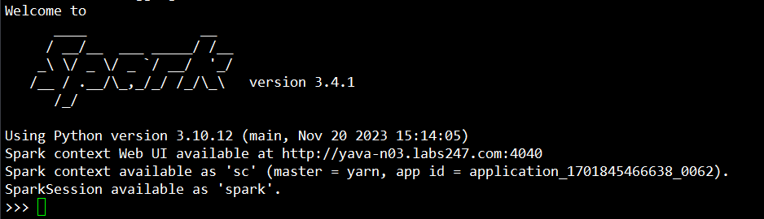
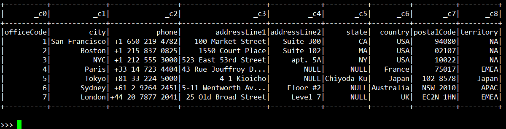
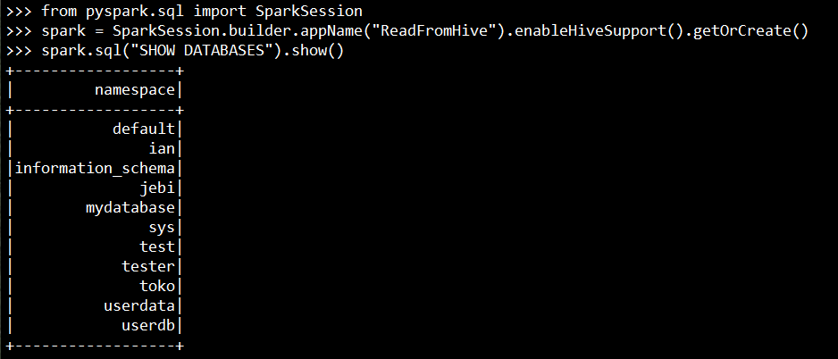
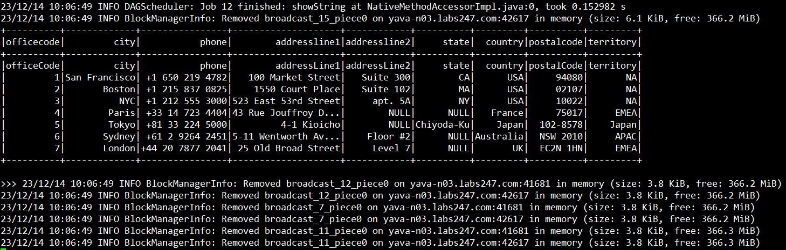

# Spark SQL Access to hive using pyspark
## Load dan Read Data CSV dari HDFS
1. Start session spark
   
    ```
    pyspark
    ```
    

#
2. Load dan Read Data ke DataFrame
   
    ```
    offices = "hdfs://yavabuntu/tmp/jebi/offices/offices.csv"
    ```
    ```
    df = spark.read.csv(offices)
    ```   
#
3. Menampilkan Data

    ```
    df.show()
    ```
    
#
## Spark read database and table on hive using pyspark

1. Inisialisasi SparkSession untuk Hive
   
    ```
    from pyspark.sql import SparkSession
    spark = SparkSession.builder.appName("ReadFromHive").enableHiveSupport().getOrCreate()
    ```
#
2. Menampilkan Database
    ```
    spark.sql("SHOW DATABASES").show()
    ```

    
#
3. Menggunakan Database
   
    ```
    spark.sql("USE jebi")
    ```
    
#
4. Menampilkan tabel

    ```
    spark.sql("SHOW TABLES").show()
    ```
    

#
5. Membaca dan Menampilkan Data dari Tabel "employees"
   
    ```
    spark.sql("SELECT * FROM employees").show()
    ```
    