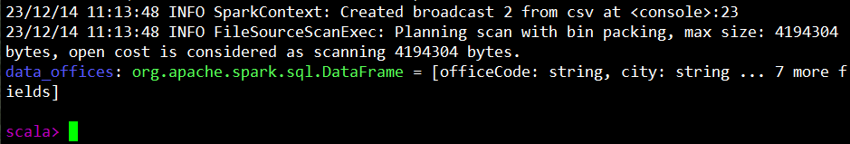
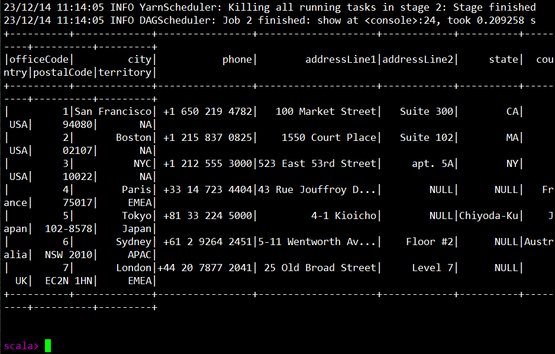
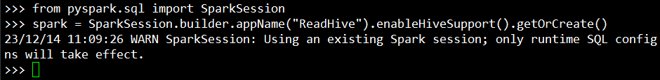
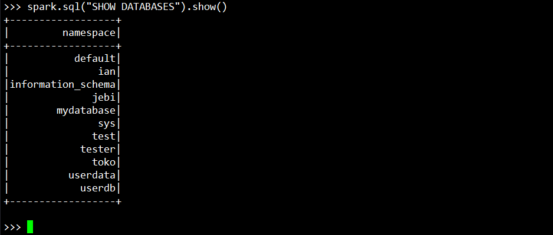
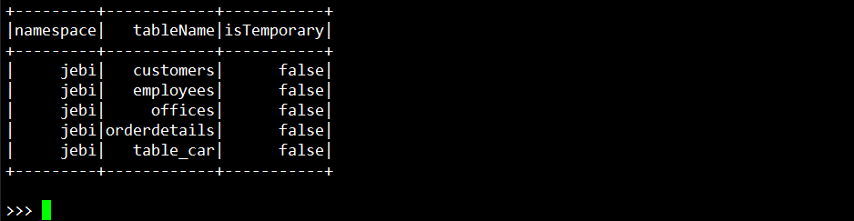
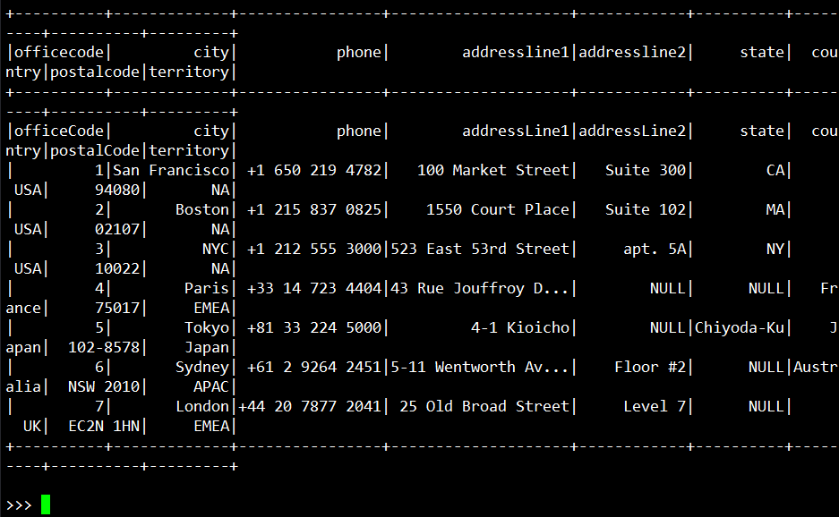

## Testing Spark

## Membaca Data CSV Menggunakan spark-shell

1. Menentukan Variabel Path CSV
   
    ```
    val data = "hdfs://yavabuntu/tmp/jebi/offices/offices.csv"
    ```
    
#
2. Atur delimiter untuk menampilkan data CSV:

    ```
    val data_offices = spark.read.option("delimiter", ",").option("header", "true").csv(data)
    ```
    
    
#
3. Tampilkan data sebanyak 10 baris:

    ```
    data_offices.show(10)
    ```
    


#
## Membaca Database dan Tabel pada Hive Menggunakan PySpark

1. Menentukan Spark Session
   
    ```
    from pyspark.sql import SparkSession
    ```
    ```
    spark = SparkSession.builder.appName("ReadHive").enableHiveSupport().getOrCreate()
    ```
    
#
2. Menampilkan list database
    ```
    spark.sql("SHOW DATABASES").show()
    ```

    
#
3. Memilih database
    ```
    spark.sql("USE jebi")
    ```
    
#
4. Menampilkan daftar table

    ```
    spark.sql("SHOW TABLES").show()
    ```
    
#
5. Menampilkan data dari sebuah tabel tertentu
    ```
    spark.sql("SELECT * FROM offices").show()
    ```
    
