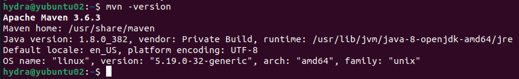

# Persiapan Environment OS
## 

## 1. Setting network static IP and hostname FQDN
- Mengatur alamat IP Statis

    ```sh
    $ sudo nano /etc/netplan/01-netcfg.yaml
    ```

- Mengedit file konfigurasi seperti berikut :
    ```sh
    network:
    version: 2
    renderer: networkd
    ethernets:
        enp2s0:
        addresses:
            - 192.168.1.41/24
        routes:
            - to: 0.0.0.0/0
            via: 192.168.1.1
        nameservers:
          addresses: [8.8.8.8, 8.8.4.4]
    ```

-  Setelah mengedit konfigurasi, simpan berkas dan apply perubahan 
    ```sh
    $ sudo netplan apply
    ```

-  Ubah Hostname, buka dan edit file berikut
    ```sh
    $ sudo nano /etc/hostname
    ```
- Lalu edit menjadi "yubuntu02.labs247.com"


## 2. Menambahkan user sudoers
- Menambahkan User baru dengan nama "hydra"
    ```sh
    $ sudo adduser hydra
    ```
    Menambahkan user "hydra" ke grup "sudo" agar mendapatkan akses Super User
    ```sh
    $ sudo usermod -aG sudo hydra
    ```

## 3. Setting SSH Access Remote di User Sudoers
- Membuah SSH key
    ```sh
    $ ssh-keygen
    ```
- Periksa Pengaturan Kata Sandi SSH: Pastikan bahwa pengguna hydra diizinkan untuk masuk melalui SSH dengan kata sandi. Pastikan baris *PasswordAuthentication* diatur ke yes.
     ```sh
    $ sudo nano /etc/ssh/sshd_config
    ```
- Menyalin Public Key ke Server melalui SSH
    ```sh
    $ ssh-copy-id hydra@192.168.1.41
    ```
- Untuk melakukan remote SSH dapat menggunakan IP statis hydra@192.168.1.41 atau hydra@yubuntu02.labs247.com 
    ```sh
    $ ssh hydra@192.168.1.41 
    ```
    ```sh
    $ ssh hydra@yubuntu02.labs247.com
    ```
## 4. Set JAVA_HOME default openjdk 1.8.0 di user sudoers
- Cek lokasi "JAVA_HOME"
    ```sh
    $ dirname $(dirname $(readlink -f $(which java)))
    ```
    Buka dan edit file berikut
    ```sh
    $ sudo nano ~/.bashrc
    ```
    Tambahkan code berikut pada file bashrc
    ```sh
    $ export JAVA_HOME=/usr/lib/jvm/java-8-openjdk-amd64
    ```
    Aktifkan variabel environment
    ```sh
    $ source ~/.bashrc
    ```
## 5. Install maven and check version (3.6.x) on user sudoers
- Update daftar paket yang ada
    ```sh
    $ sudo apt update
    ```
- Install package maven
    ```sh
    $ sudo apt install maven
    ```
- Cek versi Maven yang telah diinstal
    ```sh
    $ mvn -version
    ```
    